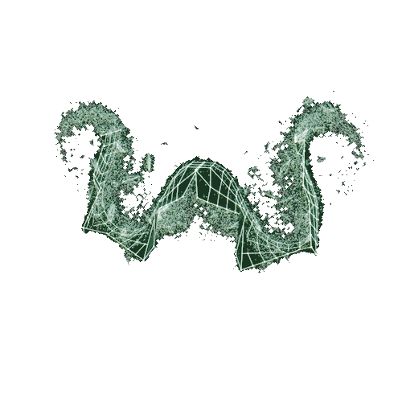

<big><big><big><big><strong>MARKUS RUHL</strong></big></big></big></big>

Signature Digital Experience

 

---

 

  This is the official personal website of <strong>Markus Rühl</strong> — one of the most recognizable physiques in professional bodybuilding history.  
  The goal wasn't just to build a website. It was to build an <em>experience</em>. 
  Something that hits you the moment you land on the page — cinematic, heavy, and unmistakably Markus.  
  The site takes you through his story, his training philosophy, his career highlights, and lets you get in touch — all wrapped in a dark, premium aesthetic with animations that feel intentional, not decorative.

  

---

 

<strong>What's inside</strong>

  Cinematic hero section &nbsp;·&nbsp; Interactive career timeline &nbsp;·&nbsp; Training programs 
  Media gallery &nbsp;·&nbsp; Contact form with live validation

 

---

 

<strong>How the hardest parts were built</strong>

 

**3D Trophy in the Browser**
The homepage features a real-time 3D trophy rendered directly in the browser using Three.js and custom GLSL shaders. It's not a video or a GIF — it's a live WebGL scene with dynamic lighting and vertex-colored materials written from scratch. On mobile it gracefully disappears to keep performance clean.

**Scroll That Tells a Story**
The career timeline isn't just a list — it animates as you scroll through it. Each entry snaps into view using GSAP's ScrollTrigger with carefully tuned easing curves, so the pacing feels like turning pages in a book, not clicking through slides.

**Zero Layout Shift on Load**
Every heavy component (3D canvas, timeline, media grid) uses a skeleton loading pattern with a minimum display time. The page never jumps or reflows as content arrives — it fades in cleanly from a placeholder that matches the exact dimensions of what's coming.

**Contact Form With Edge-Side Rate Limiting**
The contact route runs on Next.js Edge Runtime with an in-memory sliding-window rate limiter. It validates inputs server-side, sanitizes everything before processing, and returns structured error responses — no third-party form service needed.

**Algorithm-Style Training UI**
The training page has a custom SVG connection flow — nodes linking training principles like a dependency graph. It's built with pure SVG and CSS animations, not a diagram library, which keeps it fully responsive and easy to theme.

 

---

Next.js 15 &nbsp;·&nbsp; React &nbsp;·&nbsp; TypeScript &nbsp;·&nbsp; Tailwind CSS &nbsp;·&nbsp; Framer Motion &nbsp;·&nbsp; GSAP &nbsp;·&nbsp; Three.js

---

